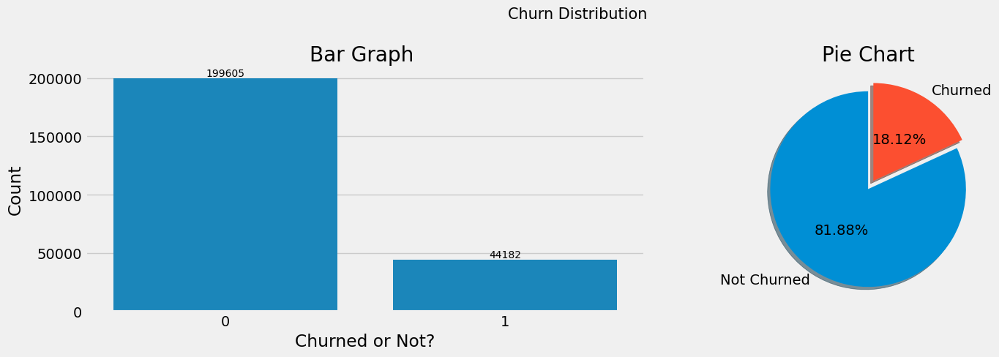
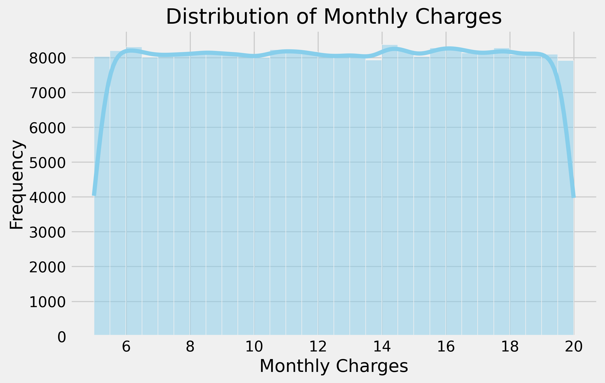
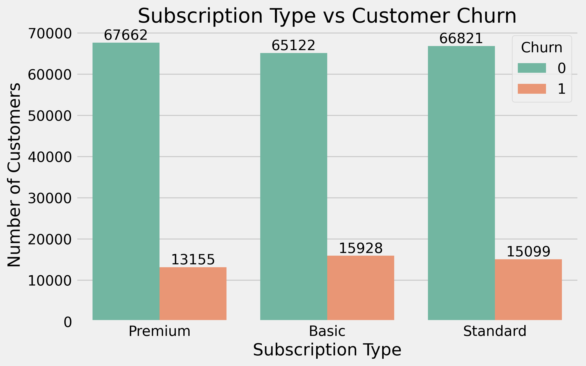
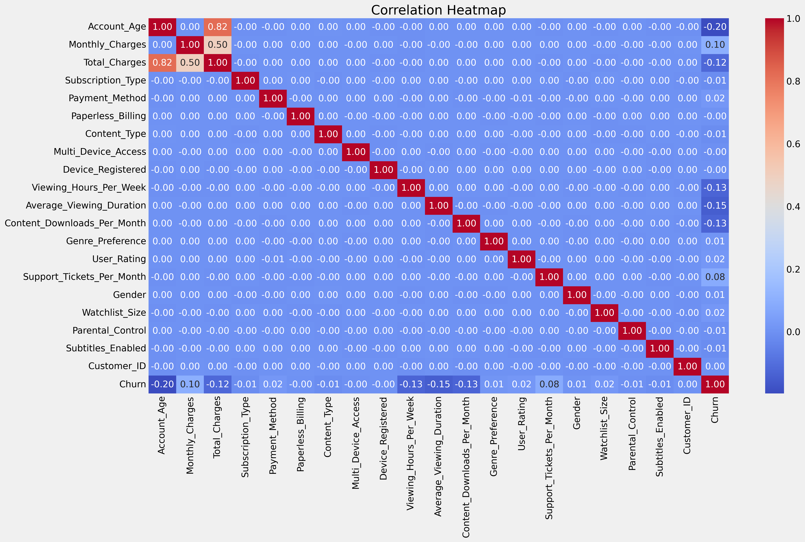
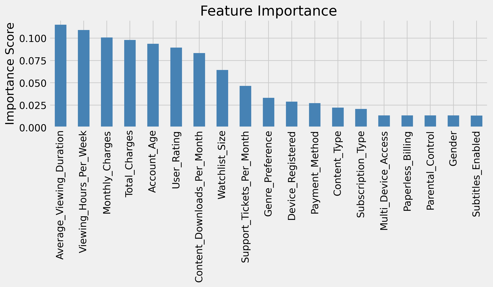

# Customer Churn Prediction

Predicting customer churn for a subscription-based service using EDA and a Random Forest classifier. Built in Google Colab.

## Overview
Customer churn is one of the biggest challenges faced by subscription-based businesses. This project analyzes customer behavior using Exploratory Data Analysis (EDA) and develops a Random Forest Classification model to predict whether a customer is likely to churn.

The project focuses on identifying the key factors influencing customer retention through data visualization and machine learning.

## Objective

- Perform data cleaning and preprocessing
- Conduct Exploratory Data Analysis (EDA)
- Identify factors influencing customer churn
- Build a Random Forest classifier
- Evaluate model performance
- Interpret important features affecting churn
 
## Dataset

- **Source:** Kaggle
- **Records:** 243,787 customers
- **Features:** 21 variables

The dataset contains customer demographics, subscription details, viewing behavior, billing information, engagement metrics, and churn status.


## Technologies Used

- Python
- Pandas
- NumPy
- Matplotlib
- Seaborn
- Scikit-learn
- Google Colab


## Project Workflow

1. Data Loading
2. Data Cleaning
3. Exploratory Data Analysis
4. Feature Encoding
5. Correlation Analysis
6. Train-Test Split
7. Random Forest Model
8. Model Evaluation
9. Feature Importance Analysis


## Visualizations

### Customer Churn Distribution



---

### Monthly Charges Distribution



---

### Subscription Type vs Customer Churn



---

### Total Charges by Subscription Type


---

### Correlation Heatmap



---

### Feature Importance




## Machine Learning Model

**Model Used**

- Random Forest Classifier

The model was trained using an 80-20 train-test split and evaluated using classification metrics and feature importance.

## Key Insights

- Customer engagement variables (Average Viewing Duration, Viewing Hours per Week, and Content Downloads per Month) were the most influential features in predicting churn.
- Billing-related attributes (Monthly Charges and Total Charges) also showed high predictive importance, indicating that pricing and spending patterns contribute to customer retention.
- Account Age and User Rating demonstrated moderate influence on churn prediction.
- Demographic and preference-related variables, including Gender, Subtitles Enabled, and Multi-Device Access, had relatively low predictive importance in the Random Forest model.

## Repository Structure

```
Customer-Churn-Prediction/
│
├── churn_rate.ipynb
├── requirements.txt
├── README.md
└── images/
```
## Author

Pakhi Saraswat 
